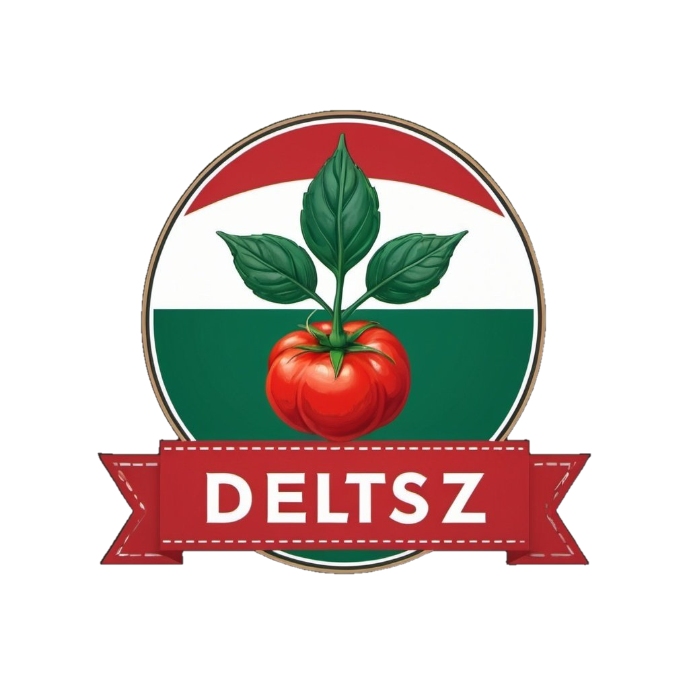

[![Progress][progress-shield]][progress-url]
[![Issues][issues-shield]][issues-url]
<a name="readme-top"></a>

<!-- PROJECT LOGO -->
<br />
<div align="center">
  <a href="https://github.com/kC0d3/DelTSZ">
    
  </a>

<h3 align="center">DelTSZ</h3>

  <p align="center">
    DelTSZ Readme documentiation
    <br />
    <a href="https://github.com/kC0d3/DelTSZ"><strong>Explore the docs »</strong></a>
    <br />
    <br />
  </p>
</div>


<!-- TABLE OF CONTENTS -->
<details>
  <summary>Table of Contents</summary>
  <ol>
    <li><a href="#about-the-project">About The Project</a></li>
    <li><a href="#features">Features</a></li>
      <ul>
        <li><a href="#user">User</a></li>
        <li><a href="#roles">Roles</a></li>
      </ul>
    <li><a href="#setup">Setup</a></li>
      <ul>
        <li><a href="#database">Database</a></li>
        <li><a href="#Server">Server</a></li>
        <li><a href="#Client">Client</a></li>
      </ul>
    <li><a href="#built-with">Built With</a></li>
  </ol>
</details>

<!-- ABOUT THE PROJECT -->

<a name="about-the-project"></a>

## About The Project

This project try to represent a gardeners organization web application which able receive producers ingredients (
vegetables) and customers can order from the owner ingredients or products which one is made by the owner.

<p align="right">(<a href="#readme-top">back to top</a>)</p>

<a name="features"></a>

## Features

<a name="user"></a>

### User

- Register and login
- Change password and user data

<a name="roles"></a>

### Roles

- Producer
    - Provide ingredients
- Customer
    - Order ingredients or products from the oldest
- Owner
    - Supervise provided ingredients
    - Create products from ingredients

<p align="right">(<a href="#readme-top">back to top</a>)</p>

<a name="setup"></a>

## Setup

### Clone the repository

### Generate .env file from .env.example

<a name="database"></a>

### Database

- Install and run Docker
- Download mcr.microsoft.com/mssql/server docker image
- Run command in terminal
  ```
  docker run -e "ACCEPT_EULA=Y" -e "SA_PASSWORD=yourStrong(!)Password" -p 1433:1433 -d mcr.microsoft.com/mssql/server
  ```
- Start generated container in Docker

<a name="server"></a>

### Server

- Install .NET latest version (8.0.6)
- Run command in terminal from the repository Server library run server
  ```
  dotnet run --project DelTSZ
  ```

<a name="client"></a>

### Client

- Install Node.js
- Run command in terminal from the repository Client library install dependencies
  ```
  npm install
  ```
- Run command in terminal from the repository Client library run client
  ```
  npm run dev
  ```

<p align="right">(<a href="#readme-top">back to top</a>)</p>

<a name="built-with"></a>

## Built With

[![ASP.NETCore][ASP.NETCore]][ASP.NETCore-url]<br>
![MSSQL]<br>
[![React][React.js]][React-url]<br>
[![Vite][Vite]][Vite-url]<br>
[![C#][C#]][C#-url]<br>
[![JavaScript][JavaScript]][JavaScript-url]<br>
![CSS3]<br>
![HTML5]<br>

<p align="right">(<a href="#readme-top">back to top</a>)</p>


[progress-shield]: https://img.shields.io/badge/In-Progress-8B0000.svg?style=for-the-badge

[progress-url]: https://github.com/kC0d3/DelTSZ/blob/main/README.md#progress

[issues-shield]: https://img.shields.io/github/issues/kC0d3/DelTSZ.svg?style=for-the-badge

[issues-url]: https://github.com/kC0d3/DelTSZ/issues

[React.js]: https://img.shields.io/badge/React-20232A?style=for-the-badge&logo=react&logoColor=61DAFB

[React-url]: https://reactjs.org/

[ASP.NETCore]: https://img.shields.io/badge/ASP.NET_Core-512BD4?style=for-the-badge&logo=.net&logoColor=white

[ASP.NETCore-url]: https://dotnet.microsoft.com/en-us/apps/aspnet

[MSSQL]: https://img.shields.io/badge/Microsoft%20SQL%20Server-CC2927?style=for-the-badge&logo=microsoft%20sql%20server&logoColor=white

[Vite]: https://img.shields.io/badge/vite-%23646CFF.svg?style=for-the-badge&logo=vite&logoColor=white

[Vite-url]: https://vitejs.dev/

[C#]: https://img.shields.io/badge/c%23-%23239120.svg?style=for-the-badge&logo=csharp&logoColor=white

[C#-url]: https://learn.microsoft.com/en-us/dotnet/csharp/

[CSS3]: https://img.shields.io/badge/css3-%231572B6.svg?style=for-the-badge&logo=css3&logoColor=white

[HTML5]: https://img.shields.io/badge/html5-%23E34F26.svg?style=for-the-badge&logo=html5&logoColor=white

[JavaScript]: https://img.shields.io/badge/javascript-%23323330.svg?style=for-the-badge&logo=javascript&logoColor=%23F7DF1E

[JavaScript-url]: https://www.javascript.com/